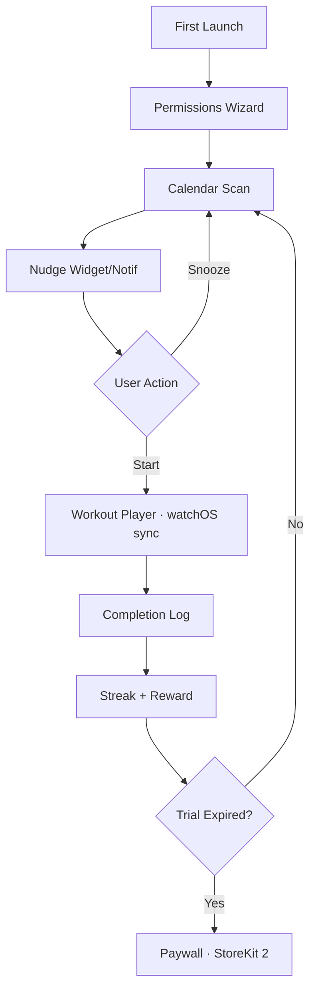

# FitDad Nudge — Product Requirements Document (PRD)

## 1. Product Overview

| Problem | Busy fathers with young kids rarely find uninterrupted workout windows; they abandon fitness plans that require >15 min blocks, manual logging, or gym trips. |
| Solution | FitDad Nudge is an iOS + watchOS app that detects 1- to 5-minute "calendar gaps" and surfaces AI-curated micro-workouts or kid-inclusive challenges via widgets, haptics, and rich notifications. |
| Target User | Tech-savvy dads 30-50 y o with ≥1 child < 12, iPhone + Apple Watch, and calendar-driven schedules. |
| Value Proposition | • Stay fit without sacrificing family/work time  •  Model healthy habits to kids  •  Earn streaks, merch, and social kudos for micro-consistency. |

---

## 2. Goals & Success Metrics (12-month targets)

| KPI Category | Metric | Target |
|--------------|--------|--------|
| Business | Paid Subscribers | 8,000 (ARR ≈ US $720k) |
| | Gross Margin | ≥ 82% |
| User | D1 Retention | ≥ 65% |
| | D7 Retention | ≥ 45% |
| | WAU/MAU Ratio | ≥ 55% |
| | Avg. Micro-Workouts / Day / Active User | ≥ 2 |
| Technical | Crash-Free Sessions | ≥ 99.3% |
| | Push / Haptic Delivery Latency | ≤ 300 ms p95 |
| | Widget Render Time | ≤ 150 ms p95 |

---

## 3. Differentiators

| Dimension | FitDad Nudge | Apple Fitness+ | MyFitnessPal | Seven | Future |
|-----------|--------------|----------------|---------------|-------|---------|
| Micro-workout focus | ✅ 1–5 min slots | ❌ ≥10 min | ❌ None | ✅ | ❌ |
| Calendar-aware timing | ✅ EventKit AI | ❌ | ❌ | ❌ | ❌ |
| Kid-inclusive content | ✅ "Dad-Kid" challenges | ❌ | ❌ | ❌ | ❌ |
| On-device ML only | ✅ Low cost | ❌ Stream | ❌ | ✅ | ❌ |
| $9/mo affordable plan | ✅ | ❌ $10/mo+ | Freemium ads | Freemium | $149/mo coach |

---

## 4. User Personas & Key Jobs-to-Be-Done

1. **"Calendar-Crunch Dad" (Core)**
   - JTBD-1 – Squeeze exercise into meeting gaps without planning.
   - JTBD-2 – Avoid guilt of skipping full workouts.
   - JTBD-3 – Show children consistency.

2. **"Weekend Warrior Dad" (Secondary)**
   - JTBD-1 – Maintain baseline fitness on weekdays.
   - JTBD-2 – Gamify routine with streaks & merch.

3. **"Coach-Mode Kid" (Influencer)**
   - JTBD-1 – Enjoy fun shared activities with dad.
   - JTBD-2 – Collect badges to brag to friends.

---

## 5. End-to-End User Flow

### Narrative Steps
1. App Launch → Sign In with Apple.
2. Permissions: Calendar (EventKit), HealthKit (optional), Notifications, Motion.
3. AI scans next 48 h calendar, surfaces first 60-sec workout tile.
4. User taps "Start" → watchOS haptic + countdown.
5. Completion auto-logged via motion or manual "Done" tap.
6. Streak updated; optional kid QR invites.
7. Paywall triggers after 14-day trial or streak ≥ 10.

### Mermaid Diagram



---

## 6. Feature Breakdown

| Feature | MVP (≤ 12 w) | Post-MVP |
|---------|--------------|----------|
| Calendar gap detection | ✅ | ⬜ Smart commute exclusion |
| 50 GIF micro-workouts | ✅ | 200-item video library |
| Dad-Kid challenges | ✅ (10) | ⬜ UGC submissions |
| iOS home-screen widget | ✅ | ✅ |
| Apple Watch haptics | ✅ | ⬜ Complications |
| Streaks & badges | ✅ | ⬜ Merch store |
| 14-day paywall | ✅ | ⬜ Family plan |
| Referrals (QR + deep link) | ✅ | ⬜ Revenue share |
| Push notification engine | ✅ | ⬜ Adaptive ML timing |

### Delightful Micro-Interactions
- Confetti burst on 7-day streak.
- Taptic "high-five" pattern when kid logs a challenge.

---

## 7. Information Architecture

```
Root TabBar
 ├─ Home (Nudges)
 ├─ Streaks
 ├─ Library
 ├─ Kids
 └─ Settings
     ├─ Calendar Sources
     ├─ Notification Tuning
     ├─ Subscription
     └─ Privacy & Data
```

---

## 8. Technical Architecture

| Layer | Stack |
|-------|-------|
| Client | Swift 5.9, SwiftUI 5.0, Combine, HealthKit, EventKit, StoreKit 2, WatchConnectivity |
| Backend | CloudKit (private + shared DB) + CloudKit Notifications |
| AI | Core ML (on-device Calendar Gap Classifier v1) |
| Analytics | Amplitude SDK (client-side), Cloud Functions export |
| CI/CD | GitHub Actions → TestFlight, Fastlane |

### High-Level ERD

```
USER ──< COMPLETION >── WORKOUT
  │                        │
  ├─< KID_PROFILE          │
  └─< REFERRAL >───────────┘
```

- Primary keys use UUID v4; CloudKit zones partitioned per USER.

---

## 9. Logging, Analytics & Telemetry

| Event Name | Properties | Purpose |
|------------|------------|---------|
| app_launch | device, version | Funnel |
| permission_granted | type | Drop-off |
| nudge_shown | gap_len, workout_id | Engagement |
| nudge_started | workout_id | |
| nudge_completed | duration, auto_detected | Core KPI |
| streak_updated | streak_len | Retention |
| paywall_view | day_of_trial | Monetization |
| subscription_started | price_tier | Revenue |

- Crashlytics for crashes; pings aggregated daily.

---

## 10. Operations & Dev-Ops
- CI/CD: PR → CI tests (XCTest + SwiftLint) → TestFlight beta → weekly production release.
- Monitoring: CloudKit metrics + Amplitude alerts + PagerDuty on-call.
- On-Call Rotation: 1 engineer primary, 1 secondary; 24 h SLA.

---

## 11. Security & Privacy
- Data at rest: AES-256 (CloudKit default).
- In transit: TLS 1.3.
- Keychain stores auth tokens; Sign in with Apple only.
- GDPR/CCPA delete endpoint in Settings.

---

## 12. Performance & Quality Targets

| Component | Metric | Goal |
|-----------|--------|------|
| Widget load | p95 render | < 150 ms |
| Watch start | Workout start latency | < 1 s |
| Battery | Session drain | < 2% / day |
| Memory | Peak RAM | < 150 MB |
| Error Budget | Crash-free users | ≥ 99% |

---

## 13. Revenue Model & Forecast (12 months)

| Item | Unit | Value |
|------|------|-------|
| Price | US $ / mo. | 9.00 |
| Free Trial | days | 14 |
| MRR Month 12 | US $ | 60k |
| LTV | US $ | 108 (ARPU 9 × 12, churn 3%) |
| CAC | US $ | 5 |
| LTV / CAC | Ratio | 21.6 |

---

## 14. Risks & Mitigations

| Type | Risk | Mitigation |
|------|------|------------|
| Market | Dads uninterested in micro-fitness | Aggressive pre-launch survey + beta list |
| Technical | Calendar gap ML mis-fires | Fallback to static heuristic if confidence < 0.6 |
| Regulatory | COPPA violations | Legal review; no kid PII |
| Execution | Content library thin | Partner with PT influencers for rapid content |

---

## 15. Milestones & Timeline (12-Week MVP)

| Week | Epic | Exit Criteria |
|------|------|---------------|
| 1–2 | Project setup, auth, permissions | Build passes CI; Sign-in flow demo |
| 3–4 | Gap detection ML & widget | ≥ 85% precision on internal test set |
| 5–6 | Workout player & watchOS sync | p95 start < 1 s; 50 workouts playable |
| 7–8 | Streaks, badges, referrals | Streak updates in CloudKit within 5 s |
| 9 | Paywall + StoreKit 2 | Sandbox purchase succeeds |
| 10 | Analytics & crashlytics | All core events firing in Amplitude |
| 11 | Closed beta (200 dads) | D1 ≥ 65%, Crash-free ≥ 99% |
| 12 | Public TestFlight | Go/No-Go review with metrics |

---

## 16. Appendix

### Glossary

| Term | Definition |
|------|------------|
| Gap | Calendar window 1–5 min between events |
| Micro-Workout | GIF-based exercise requiring ≤ 5 min |
| Streak | Consecutive day count with ≥ 1 completion |
| COPPA | U.S. Children's Online Privacy Protection Act |

---

FitDad Nudge PRD v1.0 — ready for design & engineering hand-off. 